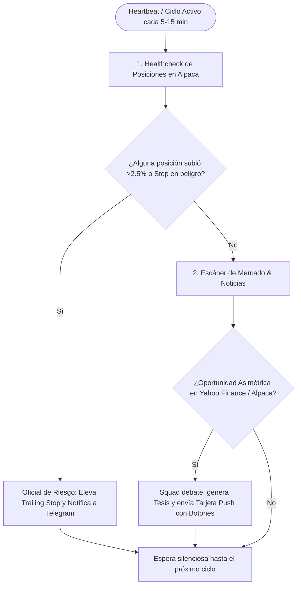

# 🐾 Paradigma OpenClaw: Agentes Activos, Autónomos y Proactivos
## Cómo funciona un Agente Activo frente a un Bot Tradicional (Pasivo)

> [!IMPORTANT]
> **Diferencia Fundamental:** 
> * **Un bot reactivo tradicional** espera callado hasta que tú le escribes: solo responde si tú le pides `/analizar` o `/resumen`.
> * **Un agente ACTIVO (estilo OpenClaw / TradingGoose)** tiene un **bucle autónomo en segundo plano (Heartbeat / Watcher)**: él tiene iniciativa propia, investiga constantemente, vigila riesgos y **te contacta a ti de forma espontánea** por Telegram cuando encuentra algo valioso o cuando una regla de riesgo se activa.

---

## 1. El Bucle Activo ("The Heartbeat Loop")

En lugar de apagarse tras cada mensaje, el sistema ejecuta un proceso continuo dentro del contenedor Docker:



---

## 2. Los 3 Pilares del Comportamiento Activo (Inspiración OpenClaw)

### A. Autonomía con Iniciativa Propia (Proactive Triggers)
El agente no necesita permiso para **investigar y vigilar**:
1. **Campana de Apertura (09:30 AM ET):** El agente te saluda en Telegram sin que se lo pidas:
   > *"Buenos días. El mercado acaba de abrir. Microsoft abrió con gap alcista (+1.2%). El portafolio total está en $100,210 USD. He elevado el stop de MSFT a $522.00 para asegurar $150 USD de ganancia. Sigo buscando entradas seguras."*
2. **Detección de Catalizadores:** Si la Reserva Federal (FED) anuncia una pausa de tasas o Microsoft reporta resultados récord, el agente filtra la noticia, calcula el impacto en tu cartera y te envía una alerta explicada en lenguaje simple.

### B. Human-in-the-Loop Inteligente (Tú como Director de Orquesta)
El agente es autónomo para **proteger**, pero respetuoso para **arriesgar**:
* **Acciones Defensivas (100% Autónomas):** Subir trailing stops para blindar ganancias, llevar órdenes a *Break-even* o cancelar órdenes vencidas.
* **Acciones Ofensivas (Requieren tu botón [✅ Aprobar]):** Comprar nuevas acciones o cerrar posiciones antes de tiempo.

### C. Memoria Contextual y Estado Persistente
Al estilo de OpenClaw, los agentes guardan un diario en SQLite/JSONL:
* Recuerdan por qué se compró cada posición.
* Saben qué propuestas ya descartaste para no ser molestos ni repetitivos.
* Aprenden tu perfil de riesgo: si sueles descartar empresas volátiles, el agente analista ajusta su filtro para priorizar empresas sólidas tipo S&P 500 y Big Tech.

---

## 3. Implementación en Código dentro de Node.js + OpenCode

Dentro de nuestro servicio Node.js en Docker, el motor activo funciona con un temporizador continuo que coordina a los agentes:

```typescript
// Bucle Activo estilo OpenClaw en src/scheduler/active_watcher.ts
export function startActiveSentinel(bot: Telegraf, opencode: OpenCodeClient) {
  // Bucle recurrente durante el horario de mercado
  setInterval(async () => {
    // 1. Verificar si el mercado está abierto
    const isMarketOpen = await checkMarketClock();
    if (!isMarketOpen) return;

    // 2. Ejecutar chequeo silencioso de riesgo
    const riskAdjustment = await runRiskEvaluator();
    if (riskAdjustment.hasUpdates) {
      await bot.telegram.sendMessage(
        CHAT_ID, 
        `🛡️ *Ajuste Automático de Protección:* ${riskAdjustment.message}`,
        { parse_mode: 'Markdown' }
      );
    }

    // 3. Ejecutar investigación autónoma con big-pickle
    const proposal = await runAutonomousResearch(opencode);
    if (proposal.foundOpportunity) {
      // Enviar tarjeta interactiva con botones táctiles
      await sendInvestmentProposalCard(bot, proposal);
    }
  }, 10 * 60 * 1000); // Se ejecuta activamente cada 10 minutos
}
```

---

## 4. Resumen: Cómo cambiará tu día a día con este sistema

* 📱 **Tú te dedicas a tus actividades:** No necesitas abrir TradingView, Alpaca ni páginas de noticias financieras.
* 🤖 **Tus agentes activos en tu VPS Dokploy:** Están vigilando cada tick de la cuenta, investigando datos con Yahoo Finance y calculando stops.
* 💬 **En tu Telegram:** Solo recibirás mensajes cuando ocurra algo importante o cuando los agentes tengan una oportunidad clara lista para que tú decidas con un toque en la pantalla.
