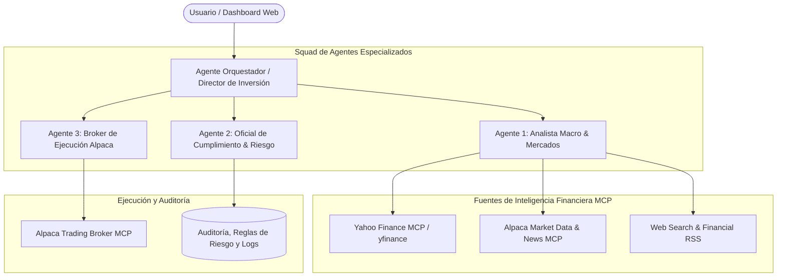

# 🏗️ Arquitectura del Sistema Multi-Agente: Broker & Análisis Financiero (Docker + Node.js + OpenCode)

> [!IMPORTANT]
> **Objetivo:** Desplegar un ecosistema contenedorizado mediante **Docker** donde convivan agentes especializados interactuando entre sí para automatizar la auditoría diaria, el análisis macro/noticias, la gestión de riesgo y la ejecución con Alpaca Broker.

---

## 1. Topología del Sistema Multi-Agente (Hierarchical Agent Pattern)

En lugar de tener un solo agente saturado de tareas, se estructura una jerarquía de agentes especializados:



### Funciones de cada Agente:

| Agente | Rol Principal | Herramientas / Permisos MCP | Regla Clave |
| :--- | :--- | :--- | :--- |
| **Director / Orquestador** | Coordina el ciclo diario, sintetiza informes y toma decisiones de alto nivel. | Comunicación entre agentes, generador de informes Markdown. | Valida consenso entre análisis y riesgo antes de autorizar órdenes. |
| **Analista de Mercado & Macro** | Investiga balances, precios históricos, recomendaciones de analistas, ratios P/E y noticias globales. | **Yahoo Finance MCP** (`yfinance-mcp-server`), **Alpaca News MCP** (`get_news`, `get_market_movers`, `get_stock_bars`), `search_web`. | Clasifica sentimiento: Alcista / Neutro / Bajista con nivel de convicción y valoración fundamental. |
| **Oficial de Riesgo (Risk Guard)** | Supervisa límites de pérdida, niveles de Stop-Loss, trailing stops y porcentaje de efectivo líquido. | Base de datos de auditoría, motor de reglas de riesgo. | **Poder de veto:** Puede frenar cualquier orden que viole las reglas de preservación de capital. |
| **Broker de Ejecución** | Interactúa directamente con la cuenta de Alpaca para consultar posiciones y colocar/ajustar órdenes. | **Alpaca Trading MCP** (`get_account_info`, `get_all_positions`, `replace_order_by_id`, `place_stock_order`). | Solo ejecuta órdenes validadas por el Oficial de Riesgo. |

---

## 2. Estructura del Proyecto en el Directorio

```text
alpaca-opencode-stack/
├── docker-compose.yml           # Orquestación de contenedores
├── Dockerfile                   # Imagen base Node.js + Python/uvx + OpenCode
├── .env.example                 # Variables de entorno y API keys seguras
├── config/
│   ├── opencode.json            # Configuración de OpenCode y agentes
│   └── mcp_servers.json         # Registro del servidor Alpaca MCP
└── src/
    ├── agents/
    │   ├── orchestrator.ts      # Agente Director
    │   ├── market_analyst.ts    # Agente de Análisis
    │   ├── risk_manager.ts      # Agente de Gestión de Riesgo
    │   └── alpaca_broker.ts     # Agente Broker ejecutor
    ├── scheduler/
    │   └── daily_cron.ts        # Horarios de Pre-Market, Cierre y Monitoreo
    └── utils/
        └── audit_logger.ts      # Registro inmutable de operaciones
```

---

## 3. Especificación de Contenedores (`docker-compose.yml`)

El entorno incluye Node.js (LTS), soporte para ejecutar herramientas MCP (`uvx` / Python para Alpaca MCP) y persistencia de memoria:

```yaml
version: '3.8'

services:
  opencode-agents:
    build:
      context: .
      dockerfile: Dockerfile
    container_name: alpaca_agent_system
    restart: unless-stopped
    env_file:
      - .env
    ports:
      - "3000:3000"  # Interfaz / API de control de OpenCode
    volumes:
      - ./data:/app/data          # Logs de auditoría e historial persistente
      - ./config:/app/config      # Configuraciones de agentes y MCP
    environment:
      - NODE_ENV=production
      - TZ=America/New_York       # Horario sincronizado con Wall Street (ET)
```

---

## 4. Configuración MCP dentro del Contenedor (`mcp_servers.json`)

Para que el agente Broker y el Orquestador tengan acceso directo al conector de Alpaca:

```json
{
  "mcpServers": {
    "alpaca": {
      "command": "uvx",
      "args": ["alpaca-mcp-server"],
      "env": {
        "ALPACA_API_KEY": "${ALPACA_API_KEY}",
        "ALPACA_SECRET_KEY": "${ALPACA_SECRET_KEY}",
        "ALPACA_BASE_URL": "https://paper-api.alpaca.markets"
      }
    },
    "yahoo-finance": {
      "command": "uvx",
      "args": ["yfinance-mcp-server"]
    }
  }
}
```

### Capacidades del Agente de Análisis con estos MCPs:
1. **Con Yahoo Finance MCP (`yfinance-mcp-server`):**
   * Precios históricos diarios, semanales y mensuales.
   * Ratios fundamentales: P/E, EPS, dividendos, deuda/capital.
   * Recomendaciones de consenso de analistas de Wall Street (Strong Buy, Buy, Hold, Sell) y precios objetivos.
   * Noticias corporativas específicas de cada ticker.
2. **Con Alpaca Market Data MCP:**
   * Velas en tiempo real (`get_stock_bars`).
   * Cotizaciones y libro de órdenes (`get_stock_quotes`, `get_stock_latest_trade`).
   * Noticias de última hora filtradas por símbolo (`get_news`).
   * Movimientos más activos del mercado (`get_market_movers`, `get_most_active_stocks`).

---

## 5. Próximos Pasos para Construirlo

1. **Crear los archivos de configuración base:** Generar el `docker-compose.yml`, `Dockerfile` y plantilla `.env`.
2. **Definir los Prompts de los 4 Agentes:** Asignar roles exactos, instrucciones de ejecución y formato de reportes JSON/Markdown.
3. **Probar el contenedor en modo Paper Trading:** Levantar el stack y verificar que el Agente Broker pueda consultar las posiciones reales de tu cuenta Alpaca de forma segura.
