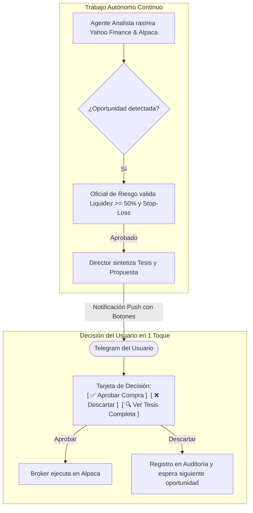

# 📋 Hoja de Ruta de Mejoras del Sistema: "Alpaca Sentinel Pro"
## Sistema Multi-Agente de Trading, Análisis Financiero y Chat Interactivo

> [!IMPORTANT]
> Esta lista de mejoras consolida las mejores prácticas de la industria financiera institucional, la arquitectura de **TradingGoose Studio**, la integración interactiva con **Telegram** y un catálogo ampliado de **Fuentes MCP de Inteligencia Financiera**.

---

## 1. 🌐 Fuentes MCP de Inteligencia Financiera (Ampliación Estratégica)

Para que el **Agente de Análisis Macro & Mercados** tenga una visión 360° institucional y no dependa de una sola fuente, se incorpora la siguiente suite de servidores MCP:

### A. Datos de Mercado y Ejecución
1. **Alpaca Market Data MCP (`alpaca-mcp-server`):**
   * Precios en tiempo real, velas por minutos/horas/días (`get_stock_bars`).
   * Noticias directas de brokers (`get_news`), volumen y activos más activos (`get_market_movers`).
2. **Yahoo Finance MCP (`yfinance-mcp-server`):**
   * Ratios fundamentales: PER (Price-to-Earnings), EPS, dividendos, flujo de caja libre, deuda/capital.
   * Recomendaciones de Wall Street (consenso *Strong Buy / Buy / Hold / Sell*) y precios objetivos a 12 meses.
   * Fechas clave del calendario de resultados corporativos (*Earnings Calendar*).

### B. Datos Macroeconómicos y Bancos Centrales
3. **FRED MCP (`mcp-fredapi` / Federal Reserve Economic Data):**
   * Tasas de interés de los Fondos Federales (Fed Funds Rate).
   * Curva de tipos y rendimiento de los bonos del Tesoro a 10 y 2 años (alerta de recesión o apetito por riesgo).
   * Datos de inflación en tiempo real (CPI, PCE) y desempleo en EE.UU.

### C. Inteligencia Corporativa y Regulatoria Oficial
4. **SEC EDGAR MCP (`sec-edgar-mcp`):**
   * Lectura de presentaciones oficiales ante la SEC: informes anuales (**10-K**), trimestrales (**10-Q**) y hechos relevantes (**8-K**).
   * **Rastreo de Insider Trading (Formulario 4):** Notifica si los directores o CEOs de Microsoft, Google, etc., están comprando o vendiendo acciones propias.

### D. Búsqueda y Sentimiento Web Especializado
5. **Perplefina / Tavily Financial MCP:**
   * Motor de búsqueda financiera profunda que filtra ruido y analiza sentimiento de analistas, Bloomberg, Reuters y CNBC.

---

## 2. 💬 Experiencia de Chat e Interacción Bidireccional: "Agentes Proactivos que Proponen Oportunidades"

> [!IMPORTANT]
> **Filosofía Clave del Sistema:** Tú no tienes que buscar qué comprar ni pasar horas analizando gráficos. **Los agentes trabajan 24/7 de forma autónoma investigando el mercado** (Yahoo Finance, Alpaca, FED, SEC EDGAR) y, cuando encuentran una oportunidad asimétrica que cumple con las reglas de riesgo, **te la presentan directamente en el chat con su justificación y botones para que tú solo tengas la última palabra**.



### A. Teclado Persistente Inferior (Enfoque en Propuestas y Supervisión)
En la parte inferior de Telegram tienes acceso directo con un solo toque:
* `[💡 Ver Nuevas Propuestas]` ➔ Consulta las oportunidades que los agentes han pre-filtrado e investigado hoy.
* `[📊 Ver Resumen Cartera]` ➔ Balance, equity, efectivo líquido y rendimiento de las posiciones vivas.
* `[🛡️ Blindar Ganancias]` ➔ Sube los pisos de protección (*Trailing Stops*) a posiciones en verde.
* `[📰 Sentimiento Macro de Hoy]` ➔ Informe de los agentes sobre qué está moviendo Wall Street.
* `[🛑 Pausa de Emergencia]` ➔ Kill-switch para suspender propuestas y compras automáticas.

### B. Formato de Notificación Proactiva de Inversión
Cuando los agentes descubren una entrada de alta probabilidad, te envían automáticamente una tarjeta interactiva como esta:

```text
💡 NUEVA PROPUESTA DE INVERSIÓN (Investigada por el Squad)

🎯 Activo: Apple Inc. (AAPL)
📊 Datos Yahoo Finance: PER 28.5 (en soporte histórico) | Wall Street Price Target: $260 (+15%)
📰 Catalizador: Nuevos contratos de IA empresarial detectados en Alpaca News.
🛡️ Visto Bueno de Riesgo:
  • Capital sugerido: $1,200 USD (1.2% del total de la cuenta)
  • Efectivo libre tras la compra: 65.6% (AMPLIAMENTE SEGURO)
  • Stop-Loss calculado: $218.50 (-3.1%)
  • Take-Profit sugerido: $255.00 (+12.8%)

¿Deseas que el broker abra esta posición?
[ ✅ Aprobar Compra ]    [ ❌ Descartar ]    [ 🔍 Leer Análisis Detallado ]
```

* Si tocas **`[ ✅ Aprobar Compra ]`**, el Broker la ejecuta inmediatamente en Alpaca y te confirma el precio exacto de llenado.
* Si tocas **`[ 🔍 Leer Análisis Detallado ]`**, el Analista te despliega el balance, márgenes operativos y la opinión de Goldman Sachs / Morgan Stanley extraída de Yahoo Finance.

---

## 3. 🛡️ Motor de Riesgo y Auditoría Institucional

1. **Audit Trail Inmutable (`audit.jsonl` + SQLite):**
   * Registro con marca temporal UTC de cada análisis, debate entre agentes, aprobación del usuario y ejecución del broker.
   * Trazabilidad completa: si una orden se ejecutó, se sabe qué agente la propuso, qué datos de Yahoo/Alpaca la fundamentaron y qué confirmación de Telegram la autorizó.
2. **Circuit Breakers (Interruptores de Emergencia):**
   * Si la cuenta cae más de un $2.0\%$ en un solo día, se activan los interruptores y se congela la operativa.
3. **Regla de Liquidez Mínima Intocable:**
   * Mantener siempre entre un $50\%$ y $60\%$ del portafolio en efectivo líquido para aprovechar caídas y proteger el patrimonio.
4. **Trailing Stops Dinámicos:**
   * Escalado automático de pisos de ganancia a medida que el precio rompe resistencias (ej. subir MSFT o QQQ sin riesgo de perder lo ganado).

---

## 4. 🐳 Infraestructura Dockerizada y Mantenimiento

1. **Despliegue en 1 Comando (`docker compose up -d`):**
   * Contenedor aislado con Node.js 20 LTS + entorno Python para servidores MCP vía `uvx`.
2. **Persistencia de Datos:**
   * Volúmenes montados para `./data` (base de datos SQLite, auditoría JSONL) y `./config` (servidores MCP).
3. **Sincronización con el Horario de Wall Street:**
   * Contenedor configurado en zona horaria `America/New_York` para disparar cron jobs a las 08:45 AM (Pre-Market), 09:30 AM (Campana inicial) y 04:15 PM ET (Cierre).
