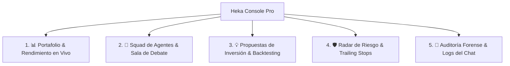

# 🚀 Plan de Mejora Integral: Dashboard Institucional de Trading y Auditoría ("Heka Console Pro")
## URL de Producción: http://heka-agentheka-custob-62ee37-144-91-80-164.sslip.io/

> [!IMPORTANT]
> **Visión del Producto:** Convertir la página actual de estado en una **Consola de Comando y Control Financiero Integral (tipo Bloomberg / TradingGoose Studio)**. La plataforma permitirá no solo ver si los agentes están vivos, sino auditar posiciones en tiempo real, visualizar gráficos interactivos, revisar el debate interno entre agentes y detonar acciones manuales o automáticas con 1 clic.

---

## 1. Arquitectura de Navegación del Nuevo Dashboard (5 Pestañas Clave)

---

## 2. Especificación Detallada de Cada Pestaña

### 📊 Pestaña 1: Portafolio & Rendimiento en Vivo (`Overview`)
* **Gráfico de Evolución del Capital (`Equity Curve`):**
  * Gráfico interactivo con Chart.js / TradingView Lightweight Charts mostrando la curva de balance histórico (desde los $\$100,000$ iniciales hasta los $\$100,191.40$ actuales).
* **Radiografía de las 7 Posiciones en Vivo:**
  * Tabla interactiva con badges verdes/rojos, porcentaje de ganancia flotante, precio de entrada y precio de mercado en tiempo real.
  * Barras de distribución visual: Gráfico circular (*Donut Chart*) mostrando el **$66.8\%$ de efectivo intocable** vs. **$33.2\%$ invertido**.
* **Métricas Institucionales Clave:**
  * Ratio de Sharpe, Max Drawdown histórico, Factor de Ganancia y P&L diario.

---

### 🧠 Pestaña 2: Squad de Agentes & Sala de Debate (`Agent Arena`)
* **Visualización del Estado de los 4 Agentes:**
  * **Director:** Estado de orquestación, última tesis redactada.
  * **Analista de Mercado:** Último escaneo en Yahoo Finance / Alpaca News, lista de activos vigilados.
  * **Oficial de Riesgo:** Semáforo de alerta (🟢 Verde = Seguro | 🟡 Amarillo = Volatilidad | 🔴 Rojo = Breaker).
  * **Broker:** Órdenes pendientes y tiempo de ejecución promedio.
* **Transcriptor del Debate Interno en Vivo:**
  * Vista estilo "Chat interno" donde puedes ver cómo el Analista propone un activo, el Oficial de Riesgo cuestiona el stop-loss y el Director sintetiza la propuesta antes de enviártela a Telegram.

---

### 💡 Pestaña 3: Centro de Oportunidades & Decisiones (`Opportunities Hub`)
* **Oportunidades en Espera de Aprobación:**
  * Tarjetas idénticas a las que recibes por Telegram, permitiéndote presionar **[✅ Aprobar Orden]** o **[❌ Descartar]** también desde la web.
* **Historial de Propuestas:**
  * Registro de qué oportunidades fueron aceptadas, cuáles descartadas y cómo se desempeñó cada ticker después del descarte (para auditar si el Analista tuvo razón).

---

### 🛡️ Pestaña 4: Radar de Riesgo & Blindaje (`Risk Radar`)
* **Monitor Visual de Trailing Stops:**
  * Barras de distancia: Cuánto le falta al precio de `MSFT`, `QQQ` o `SPY` para tocar el Stop-Loss garantizado o el Take-Profit.
* **Interruptores de Seguridad Manuales (Web Kill-Switch):**
  * Botón rojo de pánico para pausar trading y cerrar órdenes con 1 clic directo desde la interfaz.
  * Selector para ajustar el porcentaje mínimo de efectivo obligatorio (ej. subir del $50\%$ al $70\%$ en días de alta volatilidad macro).

---

### 📜 Pestaña 5: Auditoría Forense & Logs de Conversación (`Audit & Chat Trail`)
* **Consola de Logs Mejorada:**
  * Filtros avanzados por tipo de evento (`USER_ACTION`, `RISK_VALIDATION`, `ORDER_EXECUTED`, `RESEARCH_COMPLETED`).
  * Botón para **Exportar a CSV / JSON** para archivo contable o fiscal.
* **Trazabilidad de Telegram:**
  * Muestra el mensaje exacto que tú escribiste en Telegram junto con la respuesta generada por los agentes y la marca de tiempo precisa en UTC y hora de Nueva York.

---

## 3. Tecnologías Recomendadas para la Interfaz

Para mantener el sistema **ultrarrápido, sin dependencias pesadas y con cero consumo excesivo de memoria en tu VPS**:

1. **Frontend:**
   * **HTML5 + CSS Moderno (TailwindCSS / Flexbox Dark Mode):** Estilo institucional oscuro (modo terminal Bloomberg).
   * **TradingView Lightweight Charts o Chart.js:** Para renderizar gráficos financieros interactivos a 60 FPS sin ralentizar el servidor.
   * **WebSockets / Server-Sent Events (SSE):** Para que las cotizaciones y logs se actualicen en tiempo real sin tener que refrescar la página manualmente.
2. **Backend (Node.js integrado):**
   * Ampliar los endpoints existentes en `src/server/web_server.ts`:
     * `/api/portfolio/history`: Historial de equity para el gráfico.
     * `/api/agents/status`: Detalle en vivo de la actividad del modelo `opencode/big-pickle`.
     * `/api/proposals`: Propuestas activas con endpoints POST para aprobar/rechazar desde la web.

---

## 4. Fases de Implementación Propuestas

| Fase | Alcance | Resultado Esperado |
| :--- | :--- | :--- |
| **Fase 1 (Inmediata)** | Rediseño visual UI con modo oscuro premium, tabla de 7 posiciones en vivo y gráficos de distribución de capital (Efectivo vs. Inversión). | Panel ejecutivo de alta visibilidad visual. |
| **Fase 2 (Gráficos & Métricas)** | Integración de gráfico de balance histórico (`Equity Curve`) y barras de trailing stop en tiempo real. | Seguimiento visual de rendimientos diarios. |
| **Fase 3 (Control Bidireccional)** | Botones de aprobación/rechazo en la web sincronizados con Telegram y exportación de logs a Excel/CSV. | Control total desde cualquier dispositivo (móvil o laptop). |
